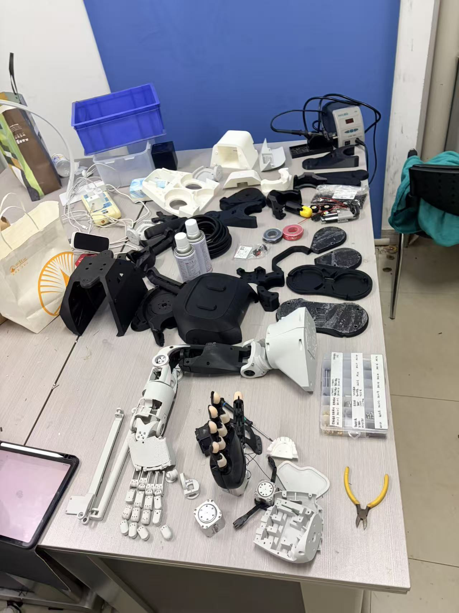
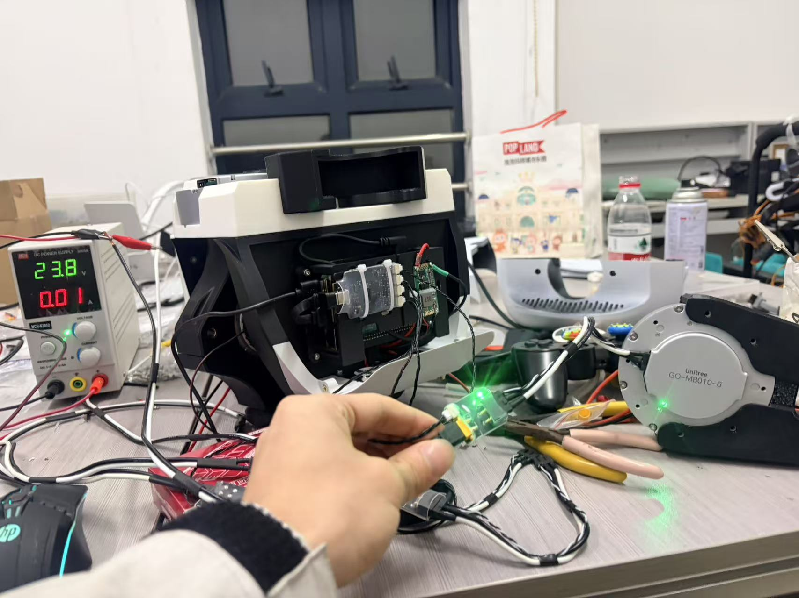
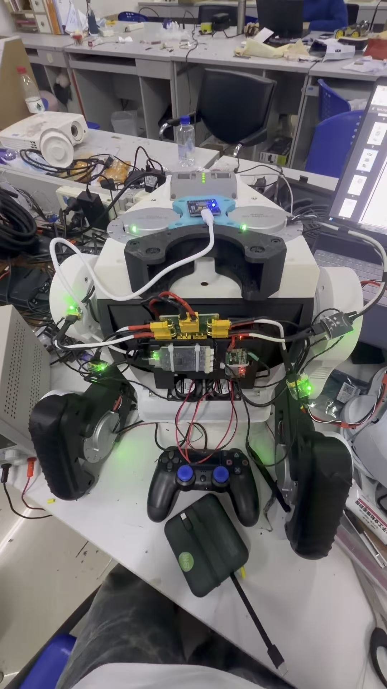
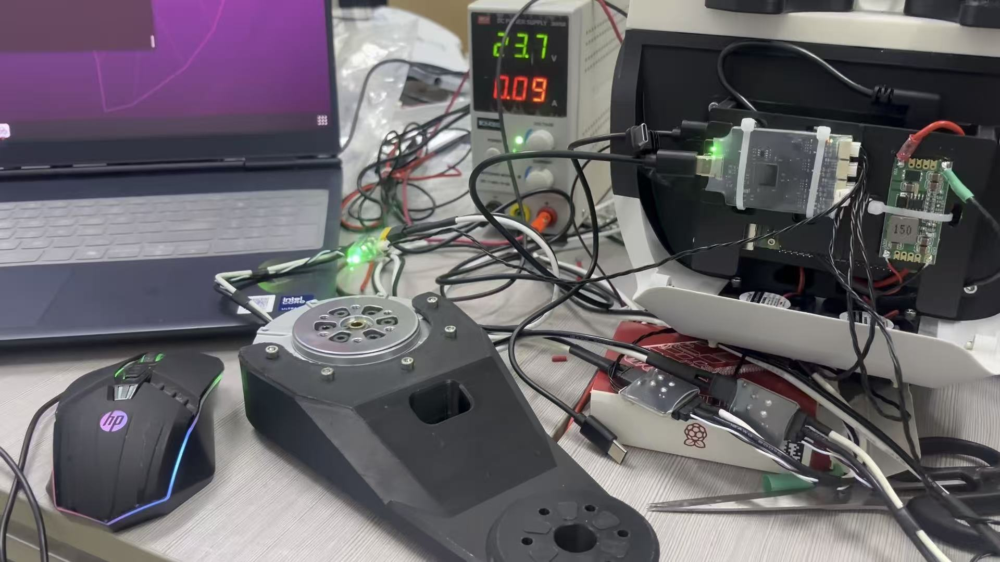
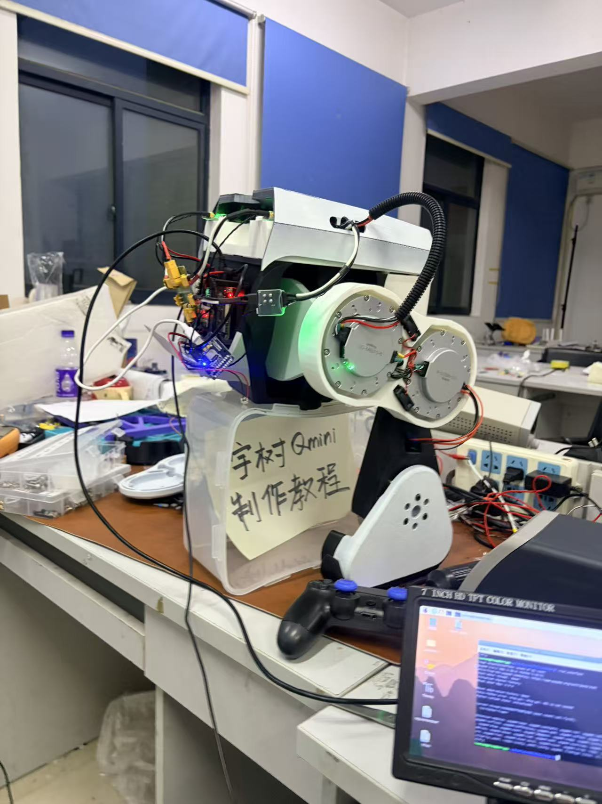
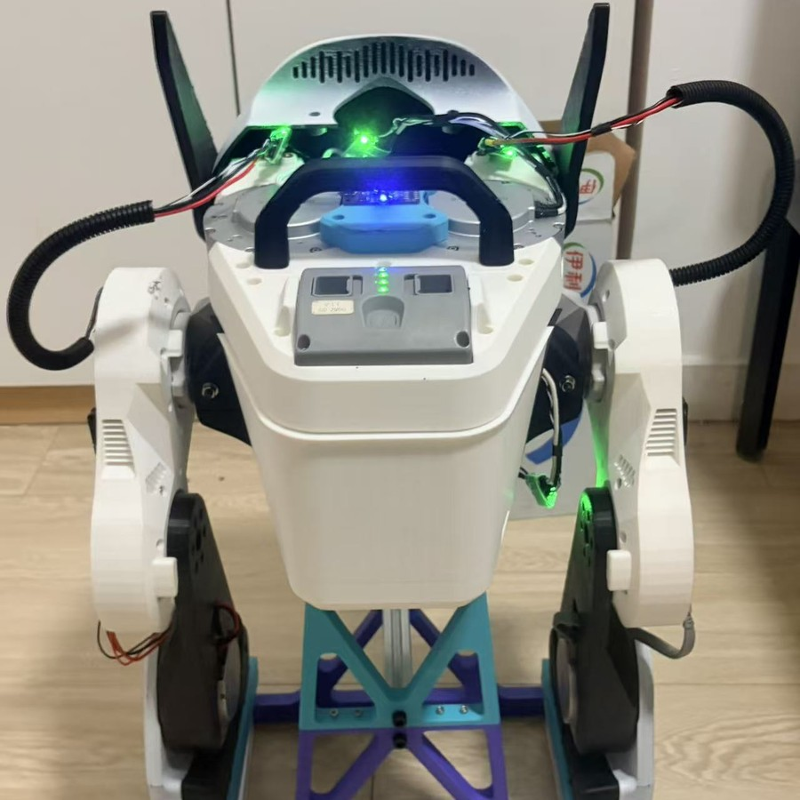
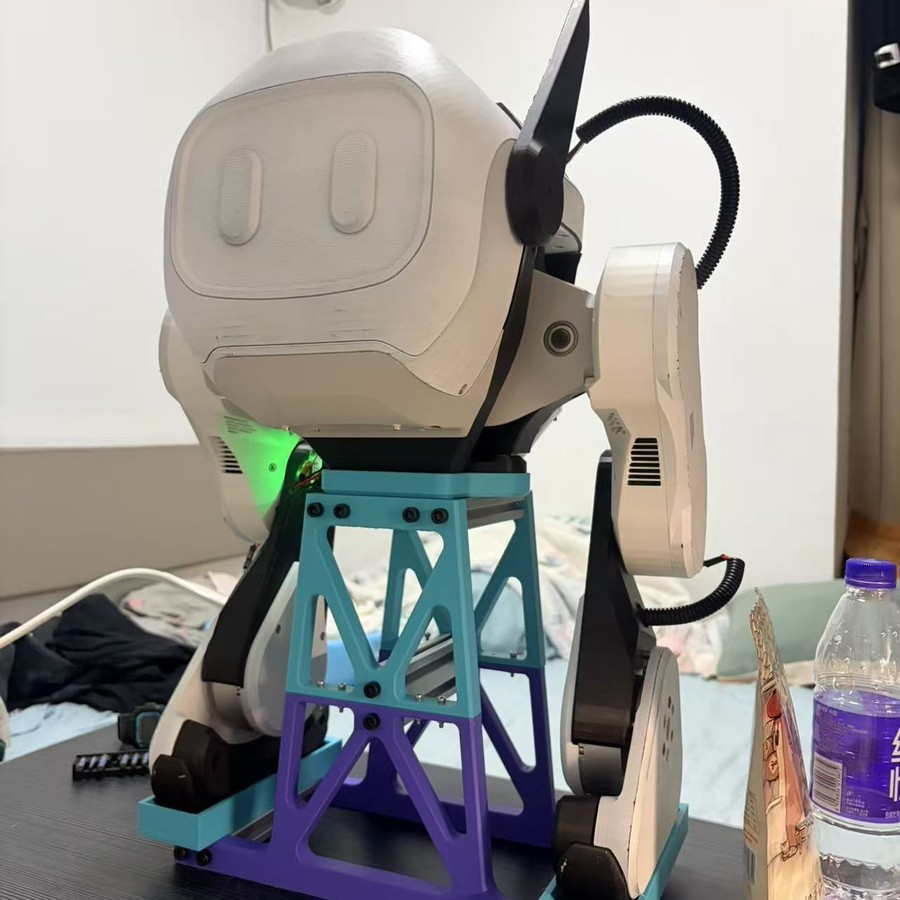
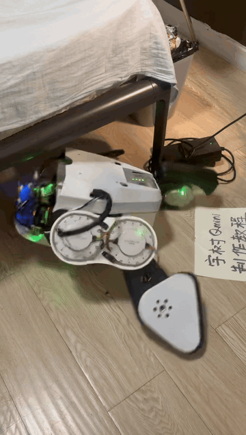
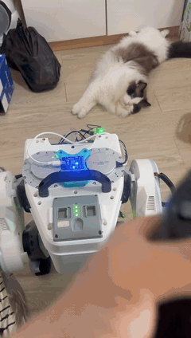

# 🤖 Modified_Qmini_SDK

<div align="center">

**基于宇树（Unitree）Qmini 机器人官方 SDK 二次开发的强化学习运动控制项目**

[](https://github.com/Liuxiang-hub/Modified_Qmini_SDK)
[](https://github.com/Liuxiang-hub/Modified_Qmini_SDK)
[](LICENSE)
[](https://github.com/Liuxiang-hub/Modified_Qmini_SDK)

</div>

---

## 📖 项目简介

本项目基于宇树 Qmini 官方 SDK（`unitree_sdk2`）进行二次开发，在原版基础上集成了 **强化学习（RL）运动控制**、**ONNX Runtime 模型推理**、**自定义手柄映射** 以及 **IMU 姿态读取** 等功能，用于驱动 Qmini 双足机器人完成站立、行走等运动任务。

除以下三处核心改动外，其余代码均沿用原版 Qmini 官方 SDK，未做额外修改。项目目前仍处于 **持续调试与优化** 阶段。

---

## ✨ 核心改动

### 1. 🎮 手柄按键映射

适配自研自定义手柄，重新编写了全部按键映射逻辑。手柄数据通过 `pygame`（Python）采集，再以 JSON 形式经 Python 嵌入接口传给 C++ 主控程序，实现“Python 读键 → C++ 控制”的无缝联动。

### 2. 🦵 初始站姿

修改了机器人开机默认站姿下各关节的初始角度与位置参数（`bin/config.yaml` 中的 `ref_joint_act`），使机器人的默认站立姿态更贴合实际调试需求。

### 3. 🔌 USB 接线

原 USB 接线方式改为 **四路线路** 布局，并同步调整了电机 ID 与接线定义的对应关系，以适配新的硬件走线方案。

---

## 🚀 功能特性

- 🧠 **强化学习运动控制**：通过 `policy.onnx` 模型进行实时推理，输出关节增量指令。
- 🕹️ **自定义手柄操控**：基于 `pygame` 的手柄读取与按键映射，支持多模式切换。
- 🧭 **IMU 姿态解算**：读取欧拉角、四元数、角速度与加速度等姿态信息。
- 🔩 **电机状态实时上报**：基于 DDS（`rt/lowstate` / `rt/lowcmd`）完成上下行通信。
- 🖥️ **多平台支持**：同时提供 `aarch64`（机器人端）与 `x86_64`（开发端）预编译库。

---

## 📁 目录结构

```text
Modified_Qmini_SDK
├── CMakeLists.txt          # CMake 构建脚本
├── LICENSE                 # 开源协议
├── README.md               # 项目说明
├── bin/                    # 可执行文件与运行时资源
│   ├── run_interface       # 主控程序
│   ├── boot.sh             # 开机自启脚本（等待手柄后启动）
│   ├── config.yaml         # RL 控制配置参数
│   ├── policy.onnx         # 强化学习策略模型
│   ├── joystick.py         # 手柄读取（pygame）
│   └── imu_*.py            # IMU 数据接口
├── include/                # 头文件
│   ├── user/               # 自定义代码（RL、手柄、IMU、电机等）
│   ├── unitree/            # 宇树 SDK 头文件
│   ├── onnx/               # ONNX Runtime 头文件
│   └── utils/              # 工具类
├── source/                 # 源码
│   ├── run_interface.cpp   # 主入口
│   └── user/               # 自定义实现（custom.cpp、rl_controller.cpp）
├── lib/                    # 预编译依赖库（aarch64 / x86_64）
└── thirdparty/             # 第三方依赖（CycloneDDS 等）
```

---

## 🧰 环境依赖

| 依赖 | 说明 |
| --- | --- |
| **Ubuntu / Linux** | 机器人端为 `aarch64`，开发端可用 `x86_64` |
| **CMake** | ≥ 3.5 |
| **GCC / G++** | 支持 C++17 |
| **Eigen3** | 矩阵与线性代数运算 |
| **jsoncpp / yaml-cpp** | JSON 与 YAML 配置解析 |
| **ONNX Runtime** | 强化学习模型推理 |
| **CycloneDDS** | `ddsc` / `ddscxx` 通信库 |
| **Python3 + pygame** | 手柄与 IMU 数据采集 |
| **Unitree SDK2 / MotorSDK** | 宇树官方静态库与电机库 |

---

## 🔨 编译构建

```bash
mkdir build && cd build
cmake ..
make -j$(nproc)
```

编译完成后，主控程序生成于 `bin/run_interface`。

---

## ▶️ 运行

直接运行主控程序（网络接口默认为 `wlan0`）：

```bash
cd bin
./run_interface
```

也可使用开机自启脚本，自动等待手柄插入后启动程序：

```bash
cd bin
./boot.sh
```

---

## 🎮 PS4 手柄按键与安全说明

以下映射已在 Sony PS4 **Wireless Controller**（USB ID `054c:05c4`）上核对。当前版本使用 `pygame.joystick` 的原始按钮编号，因此不能直接按照通用 A/B/X/Y 手柄图示操作。

### 安全操作顺序

```text
程序启动（默认零增益） → □ 站立 → ○ RL原地站立 → △ RL行走
```

1. 程序启动后默认为模式 `1`（零增益准备），无需先按键。
2. 按 **□** 进入模式 `2`，机器人在约 3 秒内过渡到默认站姿。
3. 确认站稳后按 **○** 运行 RL 原地站立。
4. 确认 RL 站立稳定后按 **△** 进入 RL 行走。

### 当前 PS4 实体按键映射

| PS4 实体按键 | 原始编号 | 当前功能 | 对应模式 / 备注 |
| --- | ---: | --- | --- |
| **×** | `0` | 退出程序 | `q`；机器人可能立即失去支撑 |
| **○** | `1` | RL 原地站立 | RL task `4` |
| **△** | `2` | RL 行走 | RL task `3` |
| **□** | `3` | 平滑移动到默认站姿 | `2` |
| **L2 / R2** | `6 / 7` | 预留任务 | `6 / 7`；未完整验证，请勿使用 |
| **SHARE / OPTIONS** | `8 / 9` | 预留任务 | `8 / 9`；未完整验证，请勿使用 |
| **PS** | `10` | 单关节正弦测试 | `5`；会立即产生关节运动 |
| **L3**（按下左摇杆） | `11` | 返回零增益准备 | `1`；机器人会变软 |
| **L1 / R1 / R3 / 方向键** | — | 当前未用 | — |

### 摇杆逻辑

| 操作 | 功能 |
| --- | --- |
| 左摇杆上 / 下 | 前进 / 后退速度 `vx` |
| 右摇杆左 / 右 | 转向角速度 `yr` |
| 左摇杆左 / 右 | 当前未用 |
| 右摇杆上 / 下 | 当前未用 |

> [!WARNING]
> - 在机器人未吊起、未扶稳或周围有人时，不要测试未知按键。
> - 按 **L3** 会返回零增益，按 **×** 会退出程序，两者都可能使站立机器人立即倒下。
> - 按 **PS** 会触发单关节正弦测试，请勿将它当作普通系统键使用。
> - 当前版本没有可靠的手柄断连急停；实机调试必须保证可以立即切断电机电源。

---

## 🔀 控制模式

| 模式 | 名称 | 说明 |
| --- | --- | --- |
| `1` | 折叠待机 | 低刚度，关节软控 |
| `2` | 站立 | 平滑过渡到默认站姿 |
| `3` | RL 行走 | 强化学习策略实时推理控制 |
| `4` | RL 站立 / 正弦摆动 | 原地步态测试 |
| `5` | 正弦测试 | 单关节正弦运动调试 |
| `q` | 退出 | 关闭程序并释放资源 |

---

## ⚙️ 配置文件说明

`bin/config.yaml` 是强化学习控制的核心配置文件，主要字段如下：

| 字段 | 含义 |
| --- | --- |
| `num_actions` / `num_observations` | 动作 / 观测维度 |
| `num_stacks` | 观测历史堆叠帧数 |
| `control_dt` | 控制周期（秒） |
| `vx_cmd_range` / `yr_cmd_range` | 前后 / 转向速度指令范围 |
| `ref_joint_act` | 默认站姿参考关节角 |
| `act_pos_low` / `act_pos_high` | 关节位置上下限 |
| `kp` / `kd` | 电机刚度 / 阻尼系数 |

---

## 📷 制作过程实拍

<div align="center">

<table>
  <tr align="center">
    <td><b>①</b><br></td>
    <td><b>②</b><br></td>
    <td><b>③</b><br></td>
  </tr>
  <tr align="center">
    <td><b>④</b><br></td>
    <td><b>⑤</b><br></td>
    <td><b>⑥</b><br></td>
  </tr>
  <tr align="center">
    <td colspan="3"><b>⑦</b><br></td>
  </tr>
</table>

</div>

## 🎬 演示动画

<div align="center">
  
  
</div>

> 🚧 这是第一次部署，跌跌撞撞调整中……

---

## 📌 项目状态

> 🚧 项目目前处于 **持续调试与优化** 阶段，部分功能仍在完善中。

---

## 👨‍💻 关于作者

本人在校本科生，独立从零手搓开发本 Qmini 机器人项目，欢迎各位大佬批评指正、提出修改建议！

如果你有任何建议、纠错或反馈，欢迎通过 GitHub Issue 与我交流。

---

## 🙏 致谢

- 感谢 [宇树科技 Unitree](https://www.unitree.com/) 提供的 Qmini 官方 SDK 与技术支持。
- 感谢原版 SDK 的开发者：山东大学 Yanyun Chen、Tiyu Fang、Kaiwen Li、Kunqi Zhang、Wei Zhang 等。

---

## 📄 开源协议

本项目基于 [MIT License](LICENSE) 开源。
